------
# Fall 2018 IE534/CS598:  HW6

**Name**: Ziyu Zhou, 
**NetID**: ziyuz2

------


## Part 1 - Training a GAN on CIFAR10
> Choose 5-6 pictures of generated images to show how training progresses (for example - epoch 0, 100, 200, 300, 400, 500).
Report your test accuracy for the two discriminators.


### Test Accuracies

|                                                | Test Accuracy | Number of epochs |
| :--------------------------------------------- | :-----------: | :--------------: |
| Discriminator  trained _without_ the Generator |    89.300%    |       100        |
| Discriminator  trained *with* the Generator    |    83.544%    |       180        |


<div style="page-break-after: always;"></div>

### Generated Images
#### Epoch 0
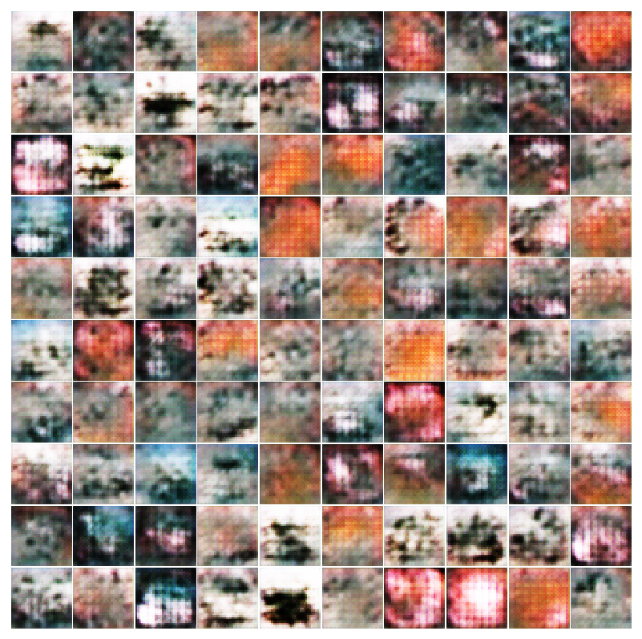


<div style="page-break-after: always;"></div>

#### Epoch 30
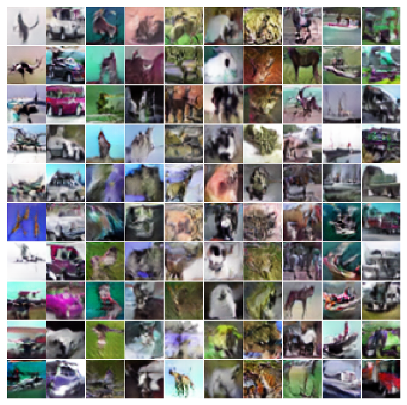


<div style="page-break-after: always;"></div>

#### Epoch 90
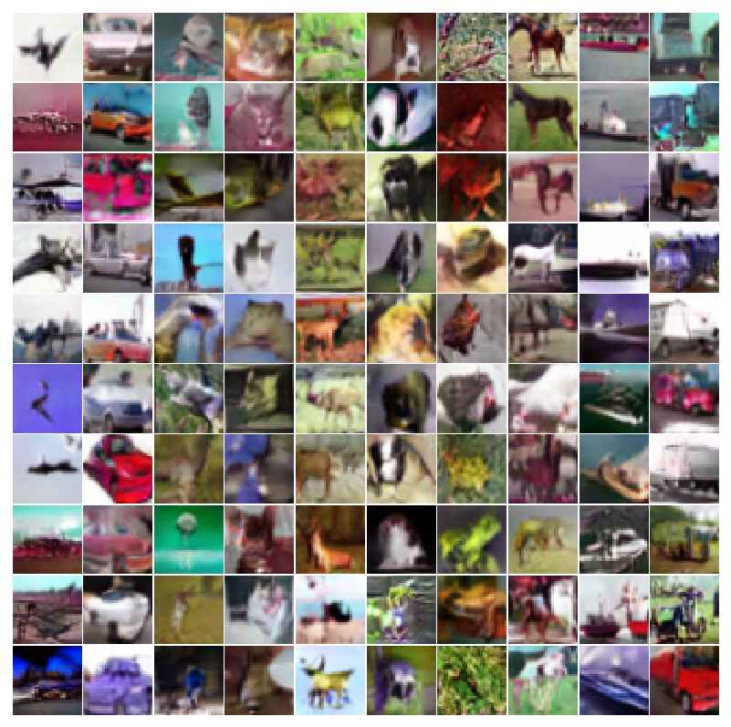


<div style="page-break-after: always;"></div>

#### Epoch 120
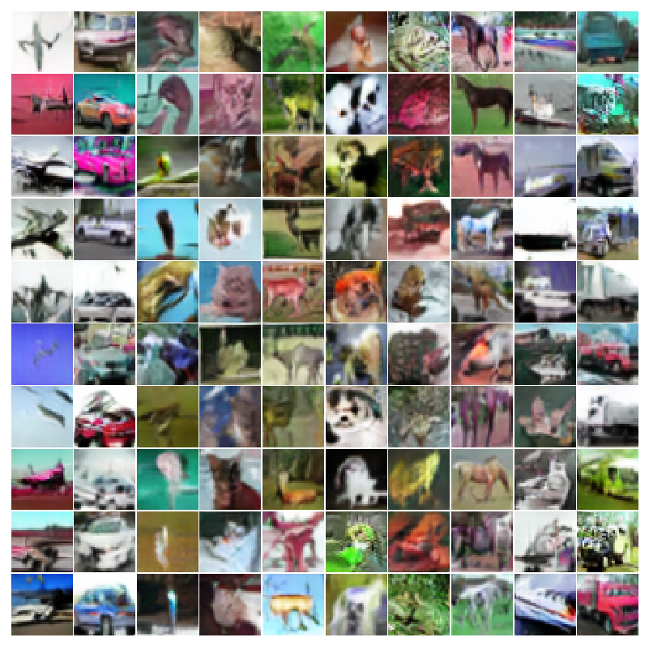


<div style="page-break-after: always;"></div>

#### Epoch 180
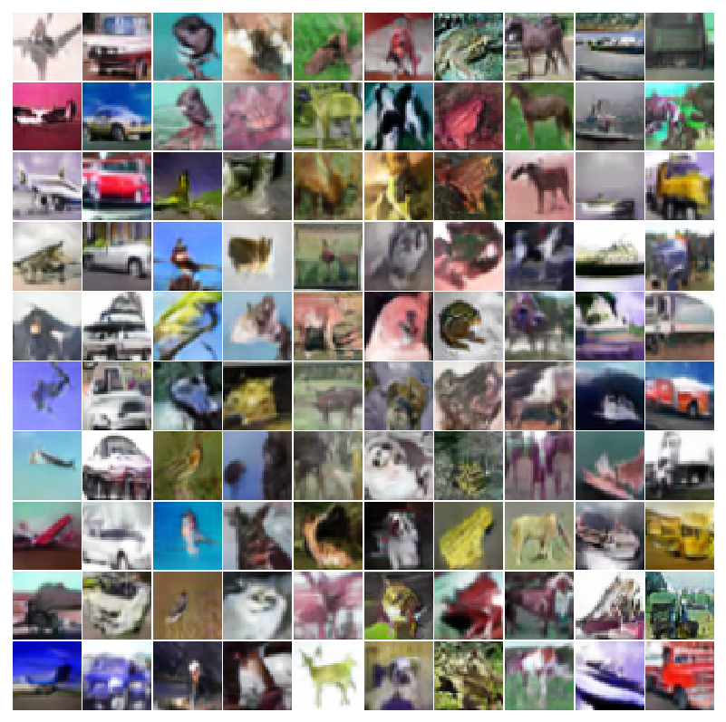


<div style="page-break-after: always;"></div>

## Part 2 - Visualization

### Perturb Real Images
> A batch of real images, a batch of the gradients from an alternate class for these images, and the modified images the discriminator incorrectly classifies.

#### Real Images
Accuracy: 92.1875%


<div style="page-break-after: always;"></div>

#### Gradients
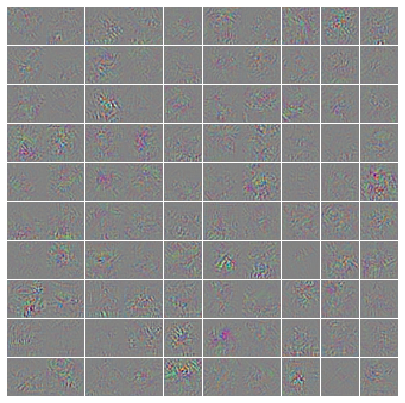


<div style="page-break-after: always;"></div>

#### Altered Images
Accuracy: 15.625%

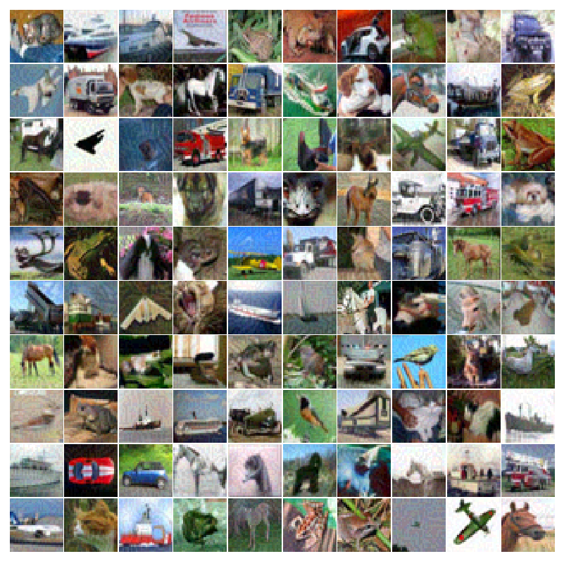


<div style="page-break-after: always;"></div>

### Synthetic Images Maximizing Classification Output
> Synthetic images maximizing the class output. One for the discriminator trained without the generator and one for the discriminator trained with the generator.

#### For discriminator trained _without_ the generator


#### For discriminator trained _with_ the generator


<div style="page-break-after: always;"></div>

### Synthetic Features Maximizing Features at Various Layers
> Synthetic images maximizing a particular layer of features. Do this for at least two different layers (for example - layer 4 and layer 8.)

#### Synthetic images maximizing layer 4 features for discriminator trained _without_ the generator

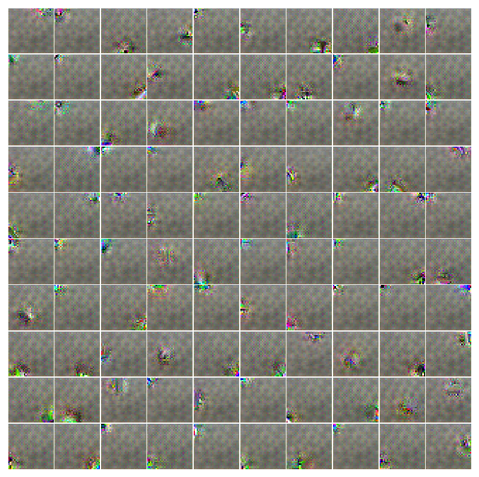


<div style="page-break-after: always;"></div>

#### Synthetic images maximizing layer 8 features for discriminator trained _without_ the generator

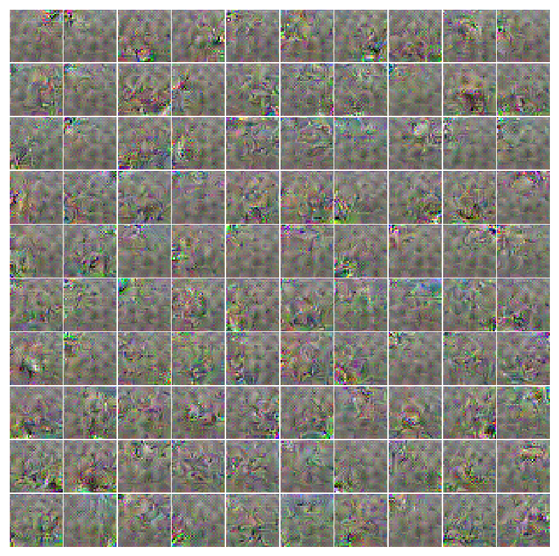


<div style="page-break-after: always;"></div>

#### Synthetic images maximizing layer 4 features for discriminator trained _with_ the generator

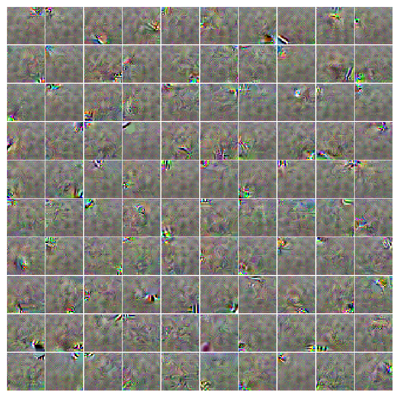


<div style="page-break-after: always;"></div>

#### Synthetic images maximizing layer 8 features for discriminator trained _with_ the generator

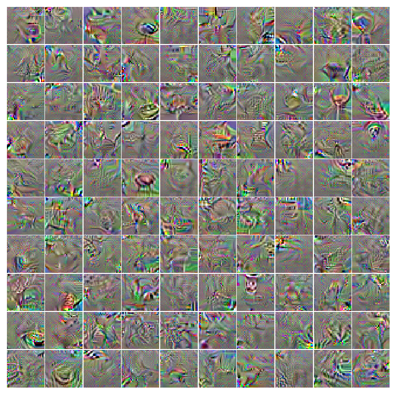


<div style="page-break-after: always;"></div>

## Usage
Files:

```
.
├── data_tools.py               # Tools to load data
├── discriminator.py            # Model of the discriminator
├── generator.py                # Model of the generator
├── train_discriminator.py      # Train discriminator without the generator
├── train_gan.py                # Train discriminator with the generator
└── visualization.py            # For visualization in part 2
```

To run the different parts of this MP:

1. Train discriminator without the Generator
    ```
    python3.6 train_discriminator.py
    ```
2. Train discriminator with the Generator
    Create an `output` folder before running the program.
    ```
    python3.6 train_gan.py
    ```
3. Visualization
    Create a `visualization` folder before running the program.
    ```
    $ python3 visualization.py --help
    usage: visualization.py [-h] [--perturb_images PERTURB_IMAGES]
                            [--max_classification_output MAX_CLASSIFICATION_OUTPUT]
                            [--max_features MAX_FEATURES]

    Part2: Visualization

    optional arguments:
    -h, --help            show this help message and exit
    --perturb_images PERTURB_IMAGES
                            section 1: pertube real image
    --max_classification_output MAX_CLASSIFICATION_OUTPUT
                            section 2: maximizing classification output
    --max_features MAX_FEATURES
                            section 2: maximizing features at various layers
    ```


